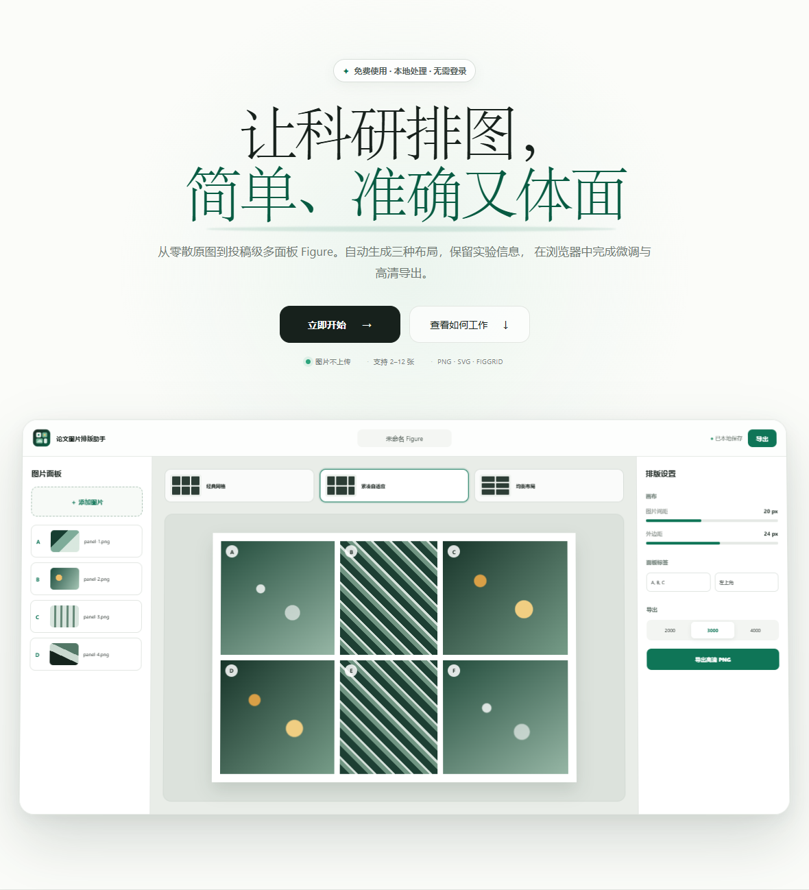
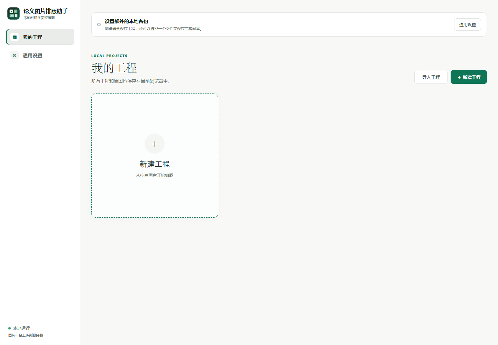
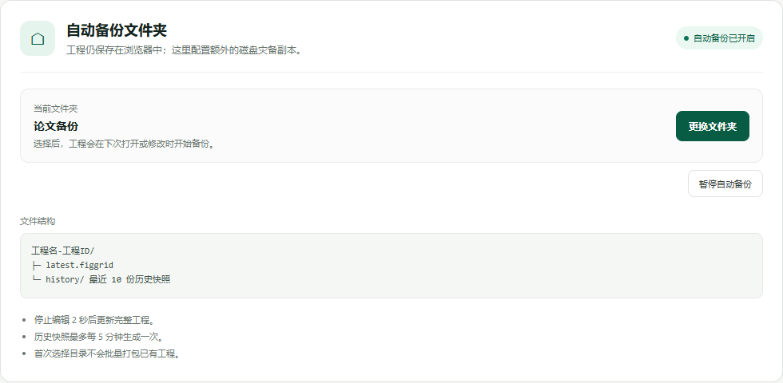
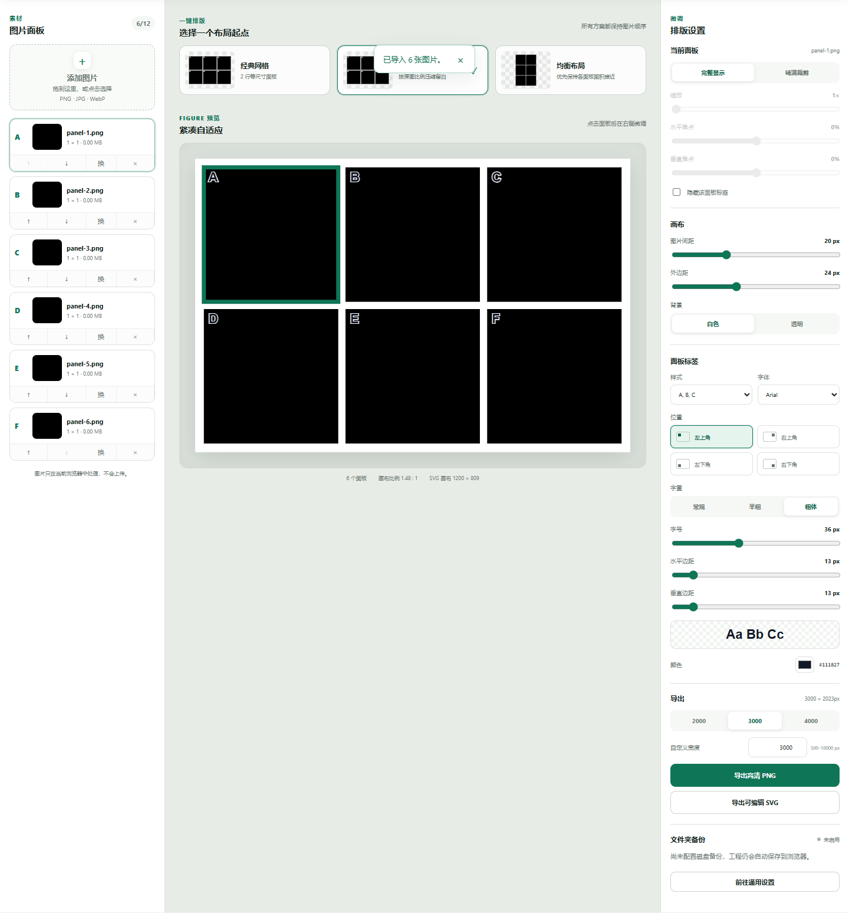
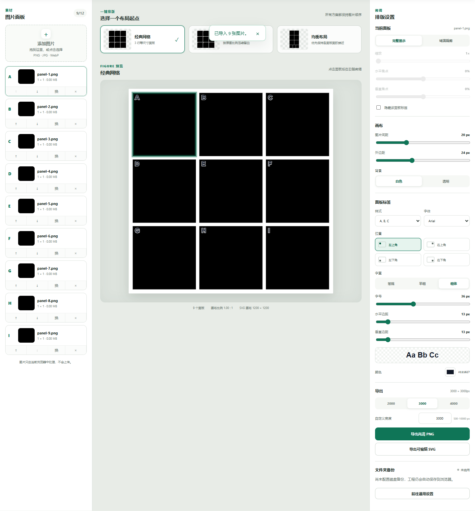

<p align="center">
  
</p>

# 论文图片排版助手

> Paper Figure Layout Assistant

一个本地优先、面向科研论文的多面板图片排版工具。通过本地工程中心管理多张 Figure，导入图片后生成确定性布局，精细控制英文字母标签，并导出高清 PNG、可编辑 SVG 或自动备份到本地文件夹的 `.figgrid` 工程文件。

A local-first multi-panel figure composer for scientific papers. Import images, compare deterministic layouts, precisely style panel labels, and export a high-resolution PNG, editable SVG, or automatically backed-up `.figgrid` project.

[中文](#中文说明) · [English](#english)

**当前版本 / Current version:** `v0.4.0 Beta`<br>
**正式域名 / Official domain:** [layout-assistant.xyz](https://layout-assistant.xyz)（ICP备案完成后开放 / available after ICP filing）

> 当前版本适合桌面端小范围测试。建议使用最新版 Chrome 或 Edge，并在清理浏览器数据前导出 `.figgrid` 或启用文件夹备份。
>
> This beta is intended for limited desktop testing. Use the latest Chrome or Edge, and export a `.figgrid` file or enable folder backup before clearing browser data.

## 界面预览

### 网站首页



### 我的工程



### 通用设置



### 六宫格：紧凑比例自适应



### 九宫格：经典网格



---

## 中文说明

### 为什么使用论文图片排版助手？

科研图片排版经常需要在 PowerPoint、Illustrator 或其他绘图软件中反复调整尺寸、间距和标签。论文图片排版助手把最常见的流程压缩成四步：

1. 导入 2–12 张图片。
2. 从三种自动布局中选择一个起点。
3. 调整面板显示方式、间距、背景和标签。
4. 导出高清图片或保存工程。

所有图片处理都在浏览器本地完成，无需账号、后端或图片上传。

### 主要功能

- **三种自动布局**：经典等宽网格、紧凑比例自适应、均衡多行布局。
- **本地工程中心**：新建、导入、打开、重命名、复制和删除多个浏览器本地工程。
- **真实缩略图**：工程卡片展示最近保存的 Figure 预览，无需加载其他工程的完整原图。
- **保持科研信息完整**：默认完整显示图片，不主动裁剪实验信息。
- **面板管理**：添加、删除、替换和调整图片顺序，标签自动更新为 `A–L`。
- **面板微调**：支持“完整显示”和“铺满裁剪”；裁剪模式可调整缩放与焦点。
- **统一样式**：设置图片间距、画布外边距、白色或透明背景。
- **标签精细控制**：大写、小写或隐藏标签；设置字体、字重、字号、颜色、四角位置和水平/垂直边距。
- **高清导出**：导出 2000、3000、4000 px 或 500–10000 px 自定义宽度的 PNG。
- **可编辑 SVG**：原图内嵌于 SVG，面板标签保持为可编辑文本。
- **双重自动保存**：IndexedDB 自动保存当前工程；经用户授权后，可将完整 `.figgrid` 自动备份到本地文件夹。
- **可恢复工程**：支持导入、导出版本化 `.figgrid` 工程文件，并兼容旧版 V1 工程。
- **隐私优先**：无后端、无账号、无遥测，运行期间不会上传图片。

### 使用方法

打开网站后，点击“立即开始”进入“我的工程”。可以新建空白工程、导入 `.figgrid`，或点击已有工程卡片继续编辑。

#### 1. 导入图片

将图片拖入左侧“添加图片”区域，或点击该区域选择文件。支持 PNG、JPEG 和 WebP：

- 图片数量：2–12 张
- 单文件大小：不超过 25 MB
- 单张图片像素：不超过 4000 万像素
- 全部文件总大小：不超过 150 MB

导入后可以在左侧列表中调整顺序、替换或删除图片。

#### 2. 选择自动布局

顶部会生成三个不重复的候选方案：

- **经典网格**：面板大小规整，适合六宫格、九宫格等标准布局。
- **紧凑自适应**：根据原图比例减少留白。
- **均衡布局**：平衡各行高度和面板面积。

点击候选卡片即可切换。调整图片顺序后，候选布局和字母标签会自动重新计算。

#### 3. 微调面板

点击中间预览中的面板，然后在右侧设置：

- **完整显示**：显示整张图片，可能产生少量留白。
- **铺满裁剪**：填满面板区域，可调整缩放、水平焦点和垂直焦点。
- **隐藏标签**：仅隐藏当前面板的字母标签。

MVP 不支持自由移动面板、合并面板、比例尺、文字框和科研标注。

#### 4. 调整全局样式

右侧“画布”和“面板标签”区域可以设置：

- 图片间距与画布外边距
- 白色或透明背景
- 标签大写、小写或隐藏
- Arial、Times New Roman、Georgia 或 Verdana 字体
- 400、600 或 700 字重
- 标签四角位置、字号、颜色及水平/垂直边距

#### 5. 导出或保存工程

- **高清 PNG**：默认宽度为 3000 px，高度根据画布比例自动计算。
- **可编辑 SVG**：适合继续在 Illustrator、Inkscape 或浏览器中编辑。
- **`.figgrid` 工程**：包含布局、样式和原始图片，可以稍后恢复编辑。

浏览器会通过 IndexedDB 自动保存多个工程；返回“我的工程”或刷新页面后可以继续打开。工程库与当前浏览器和网站地址绑定，清理浏览器数据前建议启用文件夹备份或手动导出 `.figgrid`。

#### 6. 启用本地文件夹自动备份（可选）

进入侧边栏“通用设置”，点击“选择文件夹”并授权读写。之后工程在打开或修改时启用备份，停止编辑 2 秒后写入：

```text
安全工程名-工程ID前8位/
├─ latest.figgrid
└─ history/
   └─ YYYY-MM-DD_HH-mm-ss.figgrid
```

`latest.figgrid` 始终保持最新；历史快照最多每 5 分钟生成一份，并仅保留最近 10 份。应用只会清理由自己命名的历史文件，不会操作目录中的其他文件。写入失败时文件夹备份会暂停，但浏览器自动保存和手动导出不受影响。

文件夹备份依赖 File System Access API，仅支持 **HTTPS（以及本机 localhost）下的最新版 Chrome / Edge**。目录选择必须由用户点击触发；刷新后浏览器也可能要求重新授权。普通 HTTP 部署仍可使用排版、IndexedDB 自动保存和所有手动导出功能。

### 本地运行

需要 Node.js 和最新版 Microsoft Edge 或 Chrome。界面针对宽度不低于 1024 px 的桌面屏幕优化。

Windows PowerShell：

```powershell
npm.cmd install
npm.cmd run dev
```

macOS / Linux：

```bash
npm install
npm run dev
```

打开终端中 Vite 输出的本地地址即可使用。

### 构建与部署

```powershell
npm.cmd run build
```

构建产物位于 `dist`，可以部署到任意静态网站托管平台。使用 EdgeOne Makers 时：

```powershell
edgeone makers deploy ".\dist" --name layout-assistant
```

部署时需要完整上传 `dist` 目录（包括 `assets` 子目录）。项目使用 Hash 路由，无需服务器端路由重写。文件夹自动备份需要 HTTPS；通过普通 HTTP 或裸 IP 访问时，该功能会被禁用。

### 开发检查

```powershell
npm.cmd run lint
npm.cmd test
npm.cmd run build
npm.cmd run test:e2e
```

浏览器测试覆盖工程中心管理、真实缩略图、通用设置、六宫格 PNG/SVG 导出、九宫格布局、标签字体与位置、文件夹自动备份、非法格式提示、视觉快照，以及运行期间不产生外部网络请求。

### 项目结构

```text
src/
├─ components/          官网、工程中心、通用设置、编辑器与 SVG 预览
├─ hooks/               撤销重做、备份设置和文件夹写入队列
├─ lib/
│  ├─ layout.ts         布局枚举、评分和坐标计算
│  ├─ export.ts         SVG 与 PNG 导出
│  ├─ storage.ts        IndexedDB 自动保存
│  ├─ project-file.ts   .figgrid 打包、迁移与完整性校验
│  ├─ folder-backup.ts  文件系统写入与历史清理
│  ├─ labels.ts         预览与导出共用的标签坐标
│  └─ thumbnail.ts      工程卡片真实缩略图
├─ workers/             后台打包 .figgrid
└─ types.ts             工程、图片、面板和样式类型
e2e/                    Playwright 浏览器测试与视觉快照
```

### MVP 功能边界

当前版本暂不支持 TIFF、PDF/PPTX 导出、期刊毫米/DPI 预设、原始显微数据、自由画布、比例尺、AI 排版、云同步和多人协作。

---

## English

### Why Paper Figure Layout Assistant?

Composing scientific figures often means repeatedly resizing panels, aligning gaps, and updating labels in PowerPoint, Illustrator, or similar tools. Paper Figure Layout Assistant condenses that workflow into four steps:

1. Import 2–12 images.
2. Choose one of three generated layouts.
3. Adjust panel fitting, spacing, background, and labels.
4. Export the figure or save a recoverable project.

Everything runs locally in the browser. No account, backend, telemetry, or image upload is required.

### Features

- **Three deterministic layouts:** classic grid, compact adaptive, and balanced multi-row.
- **Local project center:** create, import, open, rename, duplicate, and delete multiple browser-local projects.
- **Real thumbnails:** identify saved figures without loading the full source images of every project.
- **No automatic information loss:** images use contain mode by default instead of being cropped.
- **Panel management:** add, remove, replace, and reorder images with automatic `A–L` labels.
- **Panel controls:** switch between contain and cover; adjust zoom and focal point in cover mode.
- **Global styling:** configure gaps, outer padding, and a white or transparent background.
- **Precise figure labels:** choose Arial, Times New Roman, Georgia, or Verdana; set weight, size, color, any corner, and horizontal/vertical offsets.
- **High-resolution PNG:** export at 2000, 3000, 4000 px or a custom width from 500–10000 px.
- **Editable SVG:** source raster images are embedded while labels remain editable SVG text.
- **Layered local saves:** keep the active project in IndexedDB and, with explicit permission, automatically back up complete `.figgrid` bundles to a chosen folder.
- **Recoverable projects:** import/export versioned `.figgrid` bundles with automatic V1 migration.
- **Local-first privacy:** imported images never leave the browser.

### How to use

Open the website and select **Start now** to enter **My Projects**. Create a blank project, import a `.figgrid` file, or select a saved card to continue editing.

#### 1. Import images

Drop files onto the add-images area in the left sidebar, or click it to open the file picker. PNG, JPEG, and WebP are supported.

- Image count: 2–12
- Maximum file size: 25 MB per image
- Maximum resolution: 40 megapixels per image
- Maximum combined size: 150 MB

Use the image list to reorder, replace, or remove panels.

#### 2. Choose a layout

The app generates three unique candidates:

- **Classic grid:** regular panel sizes for standard six- or nine-panel figures.
- **Compact adaptive:** follows source aspect ratios to reduce whitespace.
- **Balanced layout:** balances row heights and panel areas.

Select a candidate card to apply it. Reordering images deterministically recalculates both layouts and letter labels.

#### 3. Fine-tune panels

Select a panel in the central preview, then use the right inspector:

- **Contain:** keeps the entire image visible and may leave a small amount of whitespace.
- **Cover:** fills the panel and enables zoom plus horizontal and vertical focal-point controls.
- **Hide label:** hides the label for the selected panel only.

Freeform panel movement, merged panels, scale bars, text boxes, and scientific annotations are outside the MVP scope.

#### 4. Style the figure

The canvas and label sections let you configure:

- Image gap and outer padding
- White or transparent background
- Uppercase, lowercase, or hidden labels
- Arial, Times New Roman, Georgia, or Verdana
- Font weight 400, 600, or 700
- Any-corner placement, size, color, and horizontal/vertical offsets

#### 5. Export or save

- **High-resolution PNG:** defaults to 3000 px wide; height is calculated automatically.
- **Editable SVG:** suitable for further editing in Illustrator, Inkscape, or a browser.
- **`.figgrid` project:** preserves layout, styling, and original images for later editing.

Projects are automatically stored in IndexedDB and remain available in the local project center after a refresh. The library belongs to the current browser and site origin, so enable folder backup or export `.figgrid` files before clearing browser storage.

#### 6. Enable folder auto-backup (optional)

Open **General Settings** from the project-center sidebar, select a backup folder, and grant read/write access. Projects begin backing up when next opened or edited. After two idle seconds, the app updates `latest.figgrid`. It creates at most one timestamped history snapshot every five minutes and retains the latest ten. Only app-managed timestamp files are pruned; unrelated files are never removed.

Folder backup uses the File System Access API and is available only in the latest Chrome or Edge over **HTTPS (or localhost)**. The picker must be triggered by a user action, and permission may need to be renewed after a refresh. All other editor and export features continue to work on HTTP deployments.

### Run locally

Node.js and the latest Microsoft Edge or Chrome are required. The desktop UI is optimized for viewports at least 1024 px wide.

Windows PowerShell:

```powershell
npm.cmd install
npm.cmd run dev
```

macOS / Linux:

```bash
npm install
npm run dev
```

Open the local URL printed by Vite.

### Build and deploy

```powershell
npm.cmd run build
```

The production bundle is written to `dist` and can be hosted by any static-site provider. For EdgeOne Makers:

```powershell
edgeone makers deploy ".\dist" --name layout-assistant
```

Upload the complete `dist` directory, including its `assets` folder. The app uses hash-based routing, so server-side route rewriting is not required. Folder auto-backup requires HTTPS and is disabled on ordinary HTTP or bare-IP deployments.

### Verification

```powershell
npm.cmd run lint
npm.cmd test
npm.cmd run build
npm.cmd run test:e2e
```

The browser suite covers project management, real thumbnails, general settings, six-panel PNG/SVG export, nine-panel layout, label fonts and placement, folder auto-backup, invalid-file feedback, visual snapshots, and the absence of external network requests while the app is running.

### MVP limitations

TIFF, PDF/PPTX export, journal-specific mm/DPI presets, raw microscopy data, freeform canvas editing, scale bars, AI layout, cloud sync, and collaboration are intentionally out of scope.

## License

本项目采用 [MIT License](LICENSE) 开源，可自由使用、修改和分发，但需保留原始版权与许可声明。

This project is open sourced under the [MIT License](LICENSE). You may use, modify, and distribute it while retaining the original copyright and license notice.
